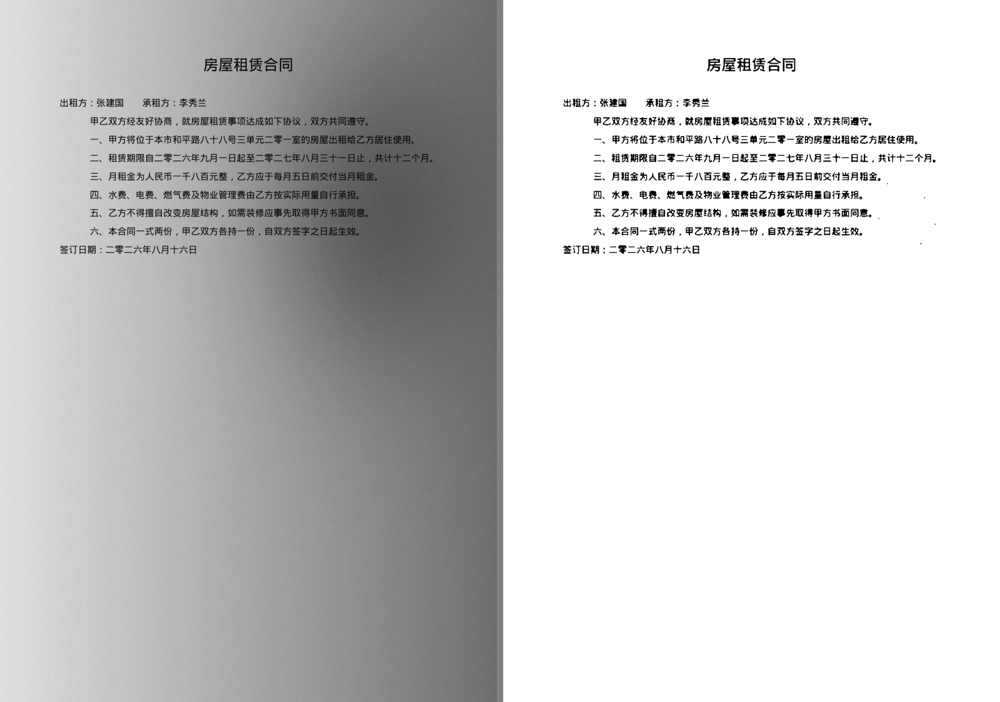

# 03 · 图片增强算法（去底）

这是 v1 最核心的功能。顾客发来手机拍的纸质文档，直接黑白打出来背景一片脏灰、文字发虚。目标是**把背景压成干净的白，把文字提成实心的黑**。

左边原图，右边处理后（合成样张，`python scripts\make_screenshots.py` 生成）：



## 为什么直接调对比度不行

拍照文档的背景**不是均匀的**：一侧有手机或人的阴影，另一侧偏亮，纸张本身还发黄。全局调对比度或全局阈值时，只要参数照顾了亮的一侧，暗的一侧文字就整片糊成黑；照顾暗的一侧，亮的一侧文字就消失。

必须先**估计出这张图的光照场，把它除掉**（flat-field correction），再统一处理。

## 流水线

每一步都可单独关闭，全部是 numpy / OpenCV，不需要 GPU。

### 1. 读图与方向纠正

Pillow 打开 → `ImageOps.exif_transpose()` 按 EXIF 旋正（手机拍的图十有八九带方向标记）→ 转 numpy。

### 2. 纸张边缘检测 + 透视校正

在缩略图上做（快，且抗噪）：灰度 → 双边滤波 → Canny → `findContours` → 对最大轮廓 `approxPolyDP` 找四边形。

**只有满足条件才校正**：四个顶点、凸多边形、面积占全图 > 25%、四角接近直角。满足则把顶点按原图比例放大，`getPerspectiveTransform` + `warpPerspective` 拉成正矩形，顺带裁掉桌面背景。

不满足就跳过 —— 宁可不校正，也不能把图切坏。这是"保守优于激进"的取舍：长辈没法判断"这张是不是被裁错了"。

### 3. 倾斜校正

没找到四边形时退一步：对二值化后的图取文字连通域的最小外接矩形角度（或霍夫直线的主方向），**只在 ±15° 内**做 `warpAffine` 旋正。超过 15° 说明判断很可能是错的，不动。

### 4. 光照拉平 —— 去阴影的关键一步

```python
# 用大核形态学闭运算估计背景：文字被"填掉"，只剩纸张的明暗分布
k = max(15, (w // 20) | 1)  # 核宽约图宽 1/20，取奇数
bg = cv2.morphologyEx(gray, cv2.MORPH_CLOSE, np.ones((k, k), np.uint8))
bg = cv2.GaussianBlur(bg, (0, 0), k / 3)  # 平滑掉残留结构
flat = cv2.divide(gray, bg, scale=255)  # 原图除以光照场
```

除法之后，阴影、纸张底色、光照渐变被整体抹平，输出接近"均匀白纸上的字"。

核的大小是关键参数：**必须明显大于笔画宽度，又不能大到把整段文字当成前景**。图宽的 1/20 在 A4 拍照（一般 2000–4000px 宽）上对应 100–200px，实测覆盖正常字号和标题。

### 5. 对比拉伸

`flat` 的直方图仍偏灰。按百分位裁剪（低 0.5–2%、高 99.2–99.8%）线性拉伸到 0–255，再加一档 gamma。用百分位而不是最小/最大值，是为了不被个别噪点带偏。

**但低百分位有个陷阱，这是后来才发现的事故（见坑三）**：它假设"最暗的那 clip_low% 像素是墨"。墨占比比 clip_low 还小的时候（只有几行字的证明、收据），低百分位就切进了**纸**的分布，纸被当成黑点拉黑。所以给黑点加了一条上限：`lo ≤ hi × 0.4`。

### 6. 四种输出模式

界面上是四个大按钮，不是下拉框。

| 模式 | 做什么 | 什么时候用 |
|---|---|---|
| **文字为主** | `binarize_clean()`：中值滤波 → 自适应阈值 → 补实心 → 强制留白 → 去杂点 | 纯文字的合同、证明、作业 —— 最清晰、最省墨 |
| **图文混排** | 灰度 + 轻度 unsharp mask + gamma，不二值化 | 有照片、印章、手写的文档 |
| **照片** | CLAHE 局部对比 + 轻 gamma，**不做去阴影** | 顾客要打的就是照片本身 |
| **自动** | 用白底比例 + 墨迹比例判定，落到「文字为主」或「图文混排」 | 默认值，长辈不用选 |

`自动` 的判据：白色像素（>200）占比 ≥ 55%，且 Otsu 阈值以下的墨迹占比在 0.5%–35% 之间 → 判为「文字为主」；否则「图文混排」。

**「照片」模式刻意跳过去阴影。**真照片的明暗本身就是内容，除掉光照场会把照片洗白。这一档只做 CLAHE，让暗部在黑白机上不糊成一团黑。

### 6.1 二值化的三个坑（都踩过）

**坑一：粗笔画和实心块会被掏空。**`adaptiveThreshold` 的窗口如果比笔画粗细还小，窗口会整个落在墨里，局部均值等于墨色，中心像素反而被判成白 —— 结果实心标题条、表头底色、印章打出来只剩一圈轮廓。

两处修法，缺一不可：

- `blockSize` 取图宽的 **1/25**（不是常见建议的"两三个字宽"）。前面已经做过光照拉平，背景本来就均匀，不需要小窗口去追局部亮度。
- 再加一条全局判据：暗过 `ink_ceiling` 的像素直接判成墨，把自适应阈值掏空的部分补回来。

**坑二：最暗一侧会撒一层黑麻点。**光照拉平是除法，暗部的噪点被同比放大（背景 100 的地方噪点放大 2.5 倍）。直接二值化，空白页边上就是一层黑麻子，打出来是脏纸。

三道防线：

- 二值化前 `medianBlur(3)` —— 中值滤波干椒盐噪点，且不糊笔画（高斯会糊）
- 亮过 `_PAPER_FLOOR` 的像素强制留白
- `despeckle()` 删掉面积过小的黑色连通域，阈值 `w*h*2.5e-6`

**坑三（最严重）：整页发黑。**上面两条修完，用带真字的样张跑全分辨率对比图，才发现两类"整片黑"：

1. **`clip_low` 超过墨占比**。一页 A4 只有几行字时墨占 0.5%，而强度 50 的 `clip_low` 是 1.25% —— 低百分位落进纸的分布，纸被当成黑点。实测最坏情况：**67 万个像素**（四分之一页）被判成墨。修法是给黑点加上限 `lo ≤ hi × 0.4`：光照拉平之后纸接近白点，算出来的黑点高过白点的 40%，说明切掉的暗部其实是纸。
2. **`ink_ceiling` 抬太高**。它是"无条件判成墨"的兜底，原来到强度 100 时是 190；阴影里没拉平干净的纸（拉伸后落在 160–190）会被整片判成墨。上限压到 **160**。

三条改动一起上之后，"不该黑的像素"少了两到三个数量级，而实心块仍然 100% 填满（回归测试守着）。

**为什么不靠加大 despeckle 力度解决**：实测 150dpi 的中文合同整页 535 个连通域里有 77 个面积 ≤ 10px²（顿号的点、逗号的尾巴都在这个量级）。阈值从 5 抬到 11 能多清掉一些噪点，代价是又丢 6 个真标点。**宁可留几个看不见的麻点，也不能把合同里的标点吃掉。**

### 7. 强度滑块（"淡 ←→ 浓"）

界面上只有这一个可调项，0–100，默认 50。内部映射到五个参数（见 `strength_params()`）：

| 参数 | 0（淡） | 50 | 100（浓） | 作用 |
|---|---|---|---|---|
| `threshold_c` | 20 | 12 | 4 | 自适应阈值偏移。**反向**：越小越黑越粗 |
| `ink_ceiling` | 130 | 145 | 160 | 暗过这个值直接判成墨，补实心。上限刻意压在 160，见坑三 |
| `clip_low` | 0.5 | 1.25 | 2.0 | 对比拉伸低百分位（还要过 `lo ≤ hi×0.4` 这道上限） |
| `clip_high` | 99.8 | 99.5 | 99.2 | 对比拉伸高百分位 |
| `gamma` | 0.75 | 1.25 | 1.75 | >1 压暗中间调 |
| `unsharp_amount` | 0.3 | 0.9 | 1.5 | 锐化强度（文字模式不用） |

长辈只需要记住一句话：**字太淡就往右拉，背景发脏就往左拉。**

`tests/test_enhance.py::test_强度滑块单调有效` 锁住了单调性 —— 这是长辈唯一会用的调节手段，方向绝不能反。这条用**带真字的样张**而不是黑条合成图：黑条图是完美双峰，每个像素都没有歧义，滑块本来就该没有效果（纯黑的条没法更黑）；滑块真正起作用的地方是笔画边缘和淡字这些中间灰。实测在真字样张上全程墨量变化 +13%。

## 性能约定

- **预览走缩略图**：长边缩到 1000px 再跑整条流水线，滑块能实时出效果
- **打印/保存才跑全分辨率**：一次性，在工作线程里做
- 黑白打印机，最终输出灰度或 1-bit 即可，不必留彩色通道

## 后续可加（v1 不做）

- **彩色印章加深**：黑白机上红色印章会打得很淡。HSV 里提取高饱和区域单独加深，避免公章打不出来。实用性高，排在 v1.1。
- **多张拼页**：两张 A5 大小的证件拼到一张 A4，省纸。
- **自动去黑边**：扫描/拍照残留的黑边裁掉。

## 调参记录

> 每次用真实样张调整参数，都在这里加一条：样张特征 → 改了什么 → 效果。
> **目前还没有真实样张**（`samples/` 为空），下面是用 `tests/synth.py` 合成的
> "手机拍的文档"（横向阴影 + 局部暗斑 + 纸张发黄 + 噪点）调出来的初始值。
> 合成图只能证明方向没搞反，**效果好不好必须用顾客真实照片校准**。

| 日期 | 样张 | 调整 | 结果 |
|---|---|---|---|
| 2026-08-16 | 合成：横向阴影 0.55 + 暗斑 + 发黄 + 噪点 σ=4 | 初始参数：背景核宽 = 缩略图宽/20（在 800px 宽的缩略图上估计背景）、对比裁剪 1.25%/99.5% | 背景从均值 <210 提到 >245，左右亮度差降到原来的 1/3 以下 |
| 2026-08-16 | 同上，加一条粗实心黑条 | `blockSize` 从 图宽/60 改成 **图宽/25**，并加 `ink_ceiling` 全局补实心 | 修掉"实心块被掏空只剩轮廓"。改之前粗条中心是白的，改之后实心率 >98% |
| 2026-08-16 | 同上，看最暗一侧 | 二值化前加 `medianBlur(3)`、加 `_PAPER_FLOOR=235` 强制留白、加 `despeckle()` | 修掉暗部的一层黑麻点。文字模式不再做 unsharp（锐化会放大噪点） |
| 2026-08-16 | 合成图旋转 +3.5° 存 JPEG | `estimate_skew` 用横向膨胀连成文字行再取最小外接矩形 | 估出 −3.49°，误差 0.01°；旋 40° 时正确地拒绝校正（返回 0） |
| 2026-08-16 | **带真字的合成合同**（PyMuPDF 渲染中文 + 阴影 0.5 + 噪点），拿干净渲染当标准答案数"假墨/漏墨" | 三条一起改：`_PAPER_FLOOR` 235→**215**、`stretch_contrast` 加黑点上限 `lo ≤ hi×0.4`、`ink_ceiling` 上限 190→**160** | 满页文字 强度100：假墨 616,064 → **471**；稀疏页（墨0.5%）强度50：670,398 → **537**；黑条实心块仍 100% 填满；漏墨从 336 涨到 956（占真墨 2.7%，看不出来）。淡字（灰度190）仍保住 98.4% |
| 2026-08-16 | 同上 | 试过把 `despeckle` 阈值从 `2.5e-6` 抬到 `5e-6`/`8e-6` | **没采纳**：假墨还能再降，但整页 535 个连通域里会多丢 6–35 个真标点（面积 ≤10px² 的有 77 个）。宁可留几个看不见的麻点 |
