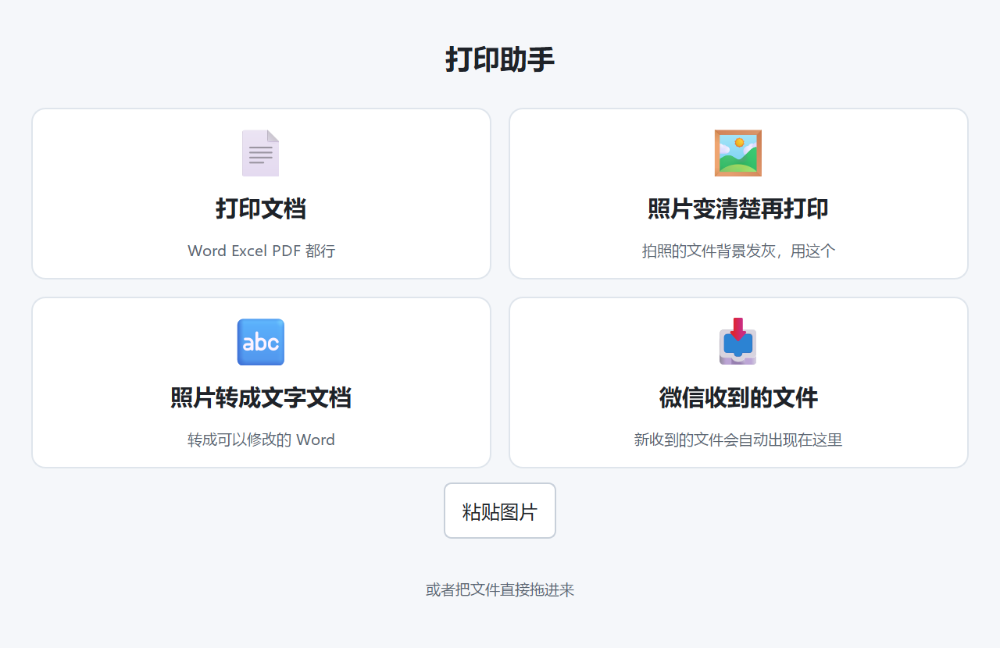
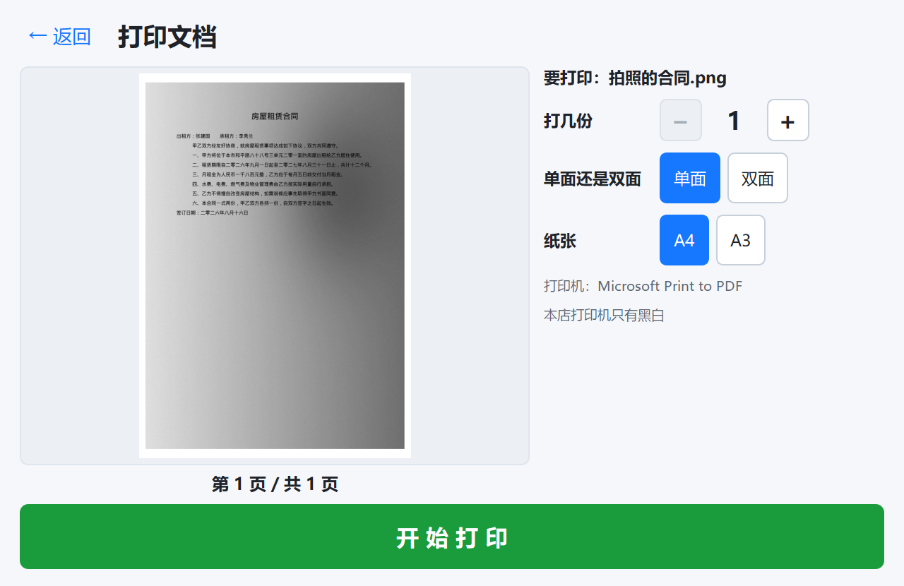
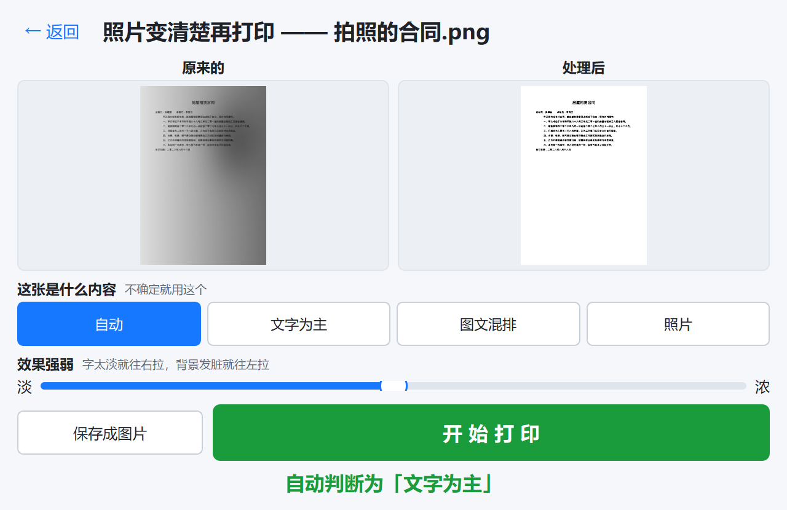
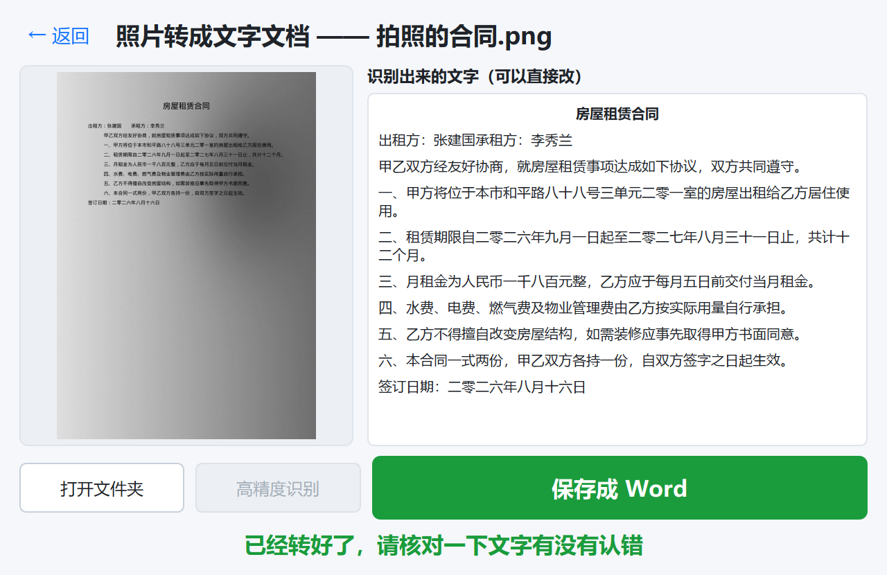
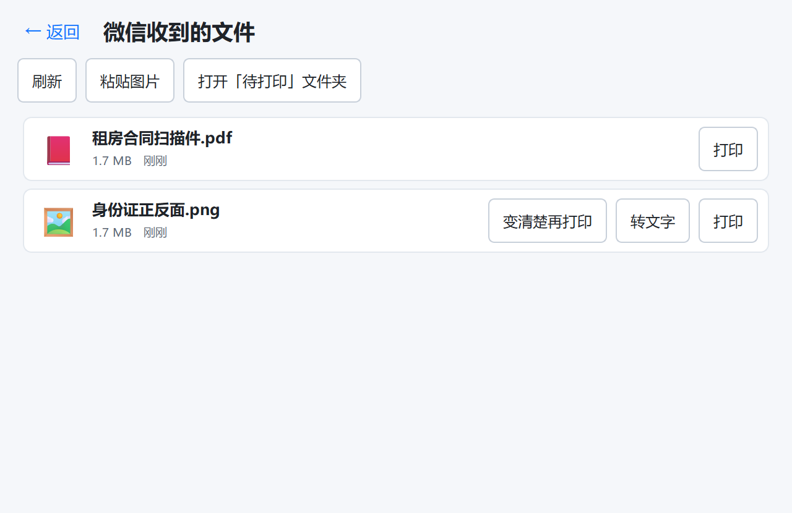
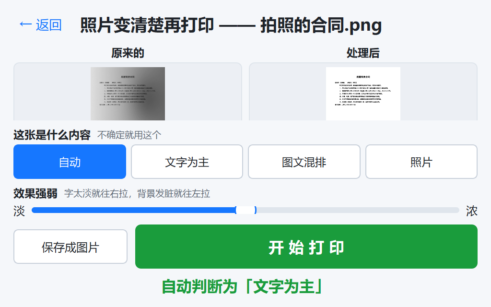

# 06 · 界面规范（长辈友好）

操作者是不熟悉电脑的长辈。这一份不是"设计建议"，是**验收标准** —— 违反其中任何一条都算 bug。

## 硬性数值

| 项 | 要求 |
|---|---|
| 正文字号 | ≥ 16pt |
| 按钮文字 | ≥ 18pt |
| 首页卡片标题 | ≥ 22pt |
| 主按钮高度 | ≥ 56px |
| 首页卡片尺寸 | ≥ 220×160px |
| 任何可点区域 | ≥ 44×44px |
| 完成一件事的点击数 | ≤ 3 |
| 窗口最小尺寸 | 1024×640（见下） |
| 窗口最小可用分辨率 | 1366×768（店铺屏幕尺寸未确认，按低的来） |

### 为什么窗口最小尺寸是 1024×640

店铺屏幕分辨率还没现场确认，最坏按 1366×768 算：减去任务栏和标题栏，实际可用高度只有 700 出头。窗口最小高度一旦超过它，Windows 会把窗口顶出屏幕，**底部那个「开始打印」大绿钮就被任务栏压住** —— 主操作点不到，整个工具就废了。

所以：最小尺寸压到 1024×640，启动时 `showMaximized()` 铺满屏幕（长辈不会自己拖窗口边框，铺满才能拿到最大的按钮和最大的预览）。

改完界面要**在 1024×640 下看一眼**：预览还看得见、主按钮还完整、没有控件被挤出去。

## 首页

一屏放下全部功能，四张大卡片。没有菜单栏、没有工具栏、没有标签页、没有设置按钮。



```
┌──────────────────────────────────────────────┐
│  打印助手                              ─  ✕  │
├──────────────────────────────────────────────┤
│   ┌───────────────┐   ┌───────────────┐     │
│   │      📄       │   │      🖼️       │     │
│   │   打印文档    │   │  照片变清楚   │     │
│   │  Word Excel   │   │    再打印     │     │
│   │   PDF 都行    │   │               │     │
│   └───────────────┘   └───────────────┘     │
│   ┌───────────────┐   ┌───────────────┐     │
│   │      🔤       │   │      📥       │     │
│   │   照片转成    │   │  微信收到的   │     │
│   │   文字文档    │   │   文件  ③     │     │
│   └───────────────┘   └───────────────┘     │
│         〔 或者把文件直接拖进来 〕            │
└──────────────────────────────────────────────┘
```

卡片文字用"要做的事"描述，不用功能名。「照片变清楚再打印」而不是「图像增强」；「照片转成文字文档」而不是「OCR 识别」。

「微信收到的文件」上带数字角标，有新文件时显示未处理数量。

## 子页面统一结构

```
← 返回          （左上角，大号，永远在同一个位置）

     ┌──────────────────┐
     │                  │
     │    大  预  览     │      控件区（少量、大）
     │                  │
     └──────────────────┘

        ┏━━━━━━━━━━━━━━━━━━━━━┓
        ┃    开 始 打 印       ┃   ← 巨大的绿色主按钮
        ┗━━━━━━━━━━━━━━━━━━━━━┛
```

三段固定：**大预览 → 少量大控件 → 一个巨大的主按钮**。主按钮在每个页面的同一位置、同一颜色。

四个子页面实际长这样（插图由 `python scripts\make_screenshots.py` 生成，改完界面重跑一次）：

| | |
|---|---|
|  |  |
| 打印文档：预览 + 份数加减 + 大绿钮 | 照片变清楚：左右对比 + 内容类型 + 强度滑块 |
|  |  |
| 照片转文字：识别结果可直接改 | 微信收到的文件：一个文件一张大卡片 |

1024×640（最坏情况的店铺屏幕）下也必须能用 —— 预览还看得见、主按钮还完整：



## 控件写法

- **数字用大加减按钮**：`− 3 +`，不用输入框、不用微调框（长辈点不准小箭头，也容易误输入字母）
- **多选一用大按钮组**，不用下拉框（下拉框要点两次，还会遮挡内容）
- **开关用带文字的大按钮**：`单面 / 双面` 两个按钮，选中的高亮，不用 checkbox
- **彩色相关选项直接禁用**，并在旁边写「本店打印机只有黑白」—— 让长辈知道这不是坏了
- **增强强度只给一个滑块**，两端写「淡」和「浓」，不显示数值

## 反馈必须又大又明确

| 时机 | 显示 |
|---|---|
| 处理中 | 大进度条 + 「正在识别，请稍等…」 |
| 打印中 | 大进度条 + 「正在打印第 2 页 / 共 5 页」 |
| 完成 | 大字 + 对勾：「打印好了 ✓」 |
| OCR 完成 | 「已经转好了，请核对一下文字有没有认错」 |

不要用小图标、状态栏、气泡提示这类容易被忽略的方式。

## 错误话术

**规则：说清楚"要你做什么"，不说"哪里出错了"。**技术细节只写进 `%LOCALAPPDATA%\ShopPrint\logs\`。

| 情况 | 不能这样写 | 要这样写 |
|---|---|---|
| 打印机离线 | `Error 0x800706BA` / `RPC 服务器不可用` | 打印机没有连上，请看看它的电源开了没有、线插好了没有 |
| 找不到打印机 | `No printer found` | 电脑上找不到打印机，请检查数据线，或者叫人来看看 |
| 文件损坏 | `Failed to parse PDF` | 这个文件打不开，可能是坏了，请让顾客重新发一次 |
| PDF 加密 | `Document is encrypted` | 这个文件有密码，打不开，请让顾客发一个没有密码的 |
| 不支持的格式 | `Unsupported file type: .psd` | 这种文件暂时打不了，请让顾客发成 PDF 或者图片 |
| 缺 Office | `COM error: Word.Application` | 这台电脑上的 Word 好像有问题，请叫人来看看 |
| OCR 失败 | `OCR engine returned empty` | 这张照片上没认出文字，可能太模糊了，请重新拍一张亮一点的 |
| 未知错误 | 堆栈 | 出了点问题，已经记录下来了。请重试一次，还是不行就叫人来看看 |

所有文案集中在 `texts.py`，不许在界面代码里写死字符串 —— 这样才能一处统一审校语气。

## 视觉

- 浅色背景，高对比度。不做深色模式（长辈更习惯白底黑字）
- 主色一个（蓝），主按钮一个（绿），危险操作一个（红）。不用第四种颜色
- 图标用 emoji 或简单矢量图，尺寸 ≥ 48px
- 不用动画过渡（会让人以为卡了），页面切换直接换

### 两个踩过的坑（都是肉眼截图才发现的）

1. **卡片里的文字有灰底方块**。全局 `QWidget { background: #f5f7fa; }` 会刷到卡片内部每个 `QLabel` 上，白卡片上就显出一个个灰框。修法：`QPushButton[role="card"] QLabel { background: transparent; }`（预览框、文件卡片同理）。
2. **预览框底色不能是纯白**。去底之后的纸是纯白的，衬在纯白框里看不出纸的边界，长辈会以为"图没出来"。预览框底色定在 `#eceff4`，比纸暗一点点。

顺带一条布局教训：`QLabel` 一旦 `setPixmap`，它的最小尺寸提示就变成图的尺寸，会**反过来把父布局撑大**；空间不够时下半张图直接被裁掉。所以预览里的 label 一律 `QSizePolicy.Ignored` + `setMinimumSize(1, 1)`，缩放只看拿到多少空间。

## 怎么再看一遍界面

`ruff` 和 `pytest` 看不出"界面难用"。改完界面要**真的开一次**（CLAUDE.md 的验证规则第 2 条）：

```powershell
python -m shop_print
```

要留证据或者一次看全部页面时，写个临时脚本把每页 `grab().save()` 存成 png（**放临时目录，别留在仓库里**）：构造 `MainWindow(config.load())`、`show()`、依次调 `_open_print / _open_photo / _open_ocr / _open_inbox`，每次 `processEvents()` 等后台线程（增强预览、OCR）出结果再截图。看这几件事：

- 卡片、按钮、字号是不是还满足上面的硬性数值
- 预览有没有被裁、白纸看不看得见
- 主按钮在不在同一个位置、有没有被挤出屏幕（顺手把窗口缩到 1024×640 再看一遍）

## 刻意隐藏的东西

设置入口：**标题栏连点 5 次**才出现。里面放打印机选择、微信目录、云端 OCR 配置、日志目录。

理由：长辈误触改坏配置的成本远高于自己改配置的便利。真要改，是你远程或到店里改。
