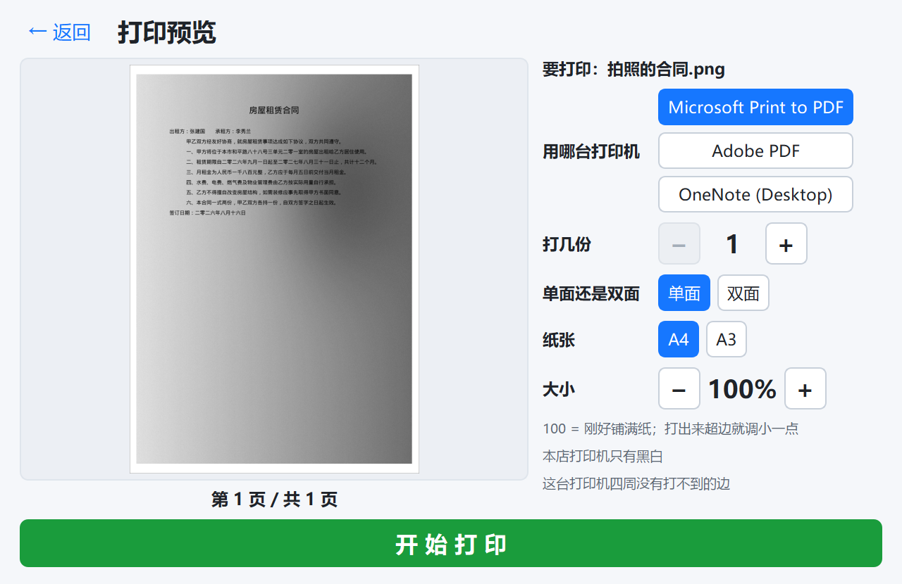
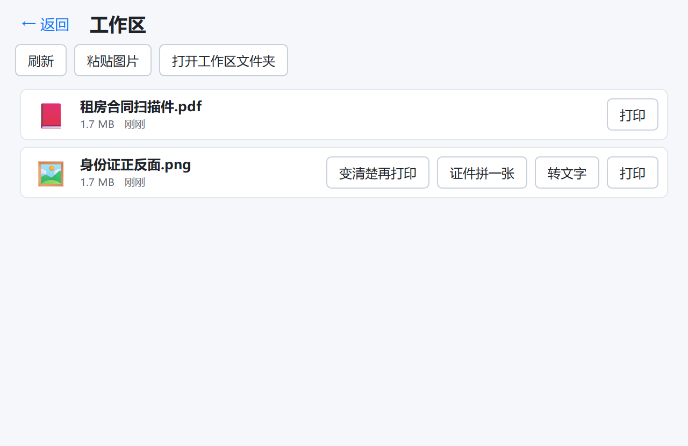

# 06 · 界面规范（长辈友好）

操作者是不熟悉电脑的长辈。这一份不是"设计建议"，是**验收标准** —— 违反其中任何一条都算 bug。

## 硬性数值

| 项 | 要求 |
|---|---|
| 正文字号 | ≥ 16pt |
| 按钮文字 | ≥ 18pt |
| 首页卡片标题 | ≥ 22pt |
| 主按钮高度 | ≥ 56px |
| 首页卡片尺寸 | ≥ 220×160px |
| 任何可点区域 | ≥ 44×44px |
| 完成一件事的点击数 | ≤ 3 |
| 窗口最小尺寸 | 1024×640（见下） |
| 窗口最小可用分辨率 | 1366×768（店铺屏幕尺寸未确认，按低的来） |

### 为什么窗口最小尺寸是 1024×640

店铺屏幕分辨率还没现场确认，最坏按 1366×768 算：减去任务栏和标题栏，实际可用高度只有 700 出头。窗口最小高度一旦超过它，Windows 会把窗口顶出屏幕，**底部那个「开始打印」大绿钮就被任务栏压住** —— 主操作点不到，整个工具就废了。

所以：最小尺寸压到 1024×640，启动时 `showMaximized()` 铺满屏幕（长辈不会自己拖窗口边框，铺满才能拿到最大的按钮和最大的预览）。

改完界面要**在 1024×640 下看一眼**：预览还看得见、主按钮还完整、没有控件被挤出去。

## 首页

一屏放下全部功能，五张大卡片（三列两行）。没有菜单栏、没有工具栏、没有标签页、没有设置按钮。


```
┌──────────────────────────────────────────────────────────────┐
│                        打印助手                        ─  ✕  │
├──────────────────────────────────────────────────────────────┤
│  ┌────────────┐  ┌────────────┐  ┌────────────┐             │
│  │     🖼️     │  │     🔤     │  │     🪪     │             │
│  │ 照片变清楚  │  │ 照片转成    │  │ 证件印一张纸│             │
│  │   再打印    │  │ 文字文档    │  │身份证/户口本│             │
│  └────────────┘  └────────────┘  └────────────┘             │
│  ┌────────────┐  ┌────────────┐                             │
│  │     📁     │  │     📋     │                             │
│  │  工作区 ③  │  │ 粘贴刚复制  │                             │
│  │            │  │  的图片     │                             │
│  └────────────┘  └────────────┘                             │
│              〔 或者把文件直接拖进来 〕                        │
└──────────────────────────────────────────────────────────────┘
```

**没有「打印文档」这一项。**原件是 Word/Excel/PDF 的时候，直接在 Office 里改好再打就行，工具在这上面帮不了忙（还多一道转换、多一道可能出错的地方）。需要打印时都是从具体的活儿进去，最后统一落到「打印预览」页。

「粘贴图片」刻意也做成一张卡片，不缩成小按钮 —— 微信里的图片走这条路最短（右键复制 → 点这张卡片），值得和别的功能一样显眼。

卡片文字用"要做的事"描述，不用功能名。「照片变清楚再打印」而不是「图像增强」；「照片转成文字文档」而不是「OCR 识别」。

「工作区」上带数字角标，有新文件时显示未处理数量。工作区 = 店里放待打印文件的那个文件夹（默认 `C:\打印\待打印`，设置里可改）加上微信收到的文件。

### 点卡片不弹文件对话框，先进页面

「照片变清楚」「照片转成文字文档」点进去**先到那一页**，页面上有一块虚线框写着「点这里选图片 / 也可以把图片拖进来」，点它才弹对话框。用户的反馈是"点击不要打开文件，先进入功能页"——理由也站得住：一上来就弹系统对话框，长辈还没看见自己进了哪个功能，就被一个满屏的文件浏览器盖住了。

同一块框子还接拖拽（拖进来直接就开始处理），已经选了图之后点预览区也能换一张（tooltip 里写着）。三个页面共用 `widgets/dropzone.py` 里的 `DropFrame`。

### 粘贴 / 拖进来的东西**先落进工作区**

粘贴的图片、拖进窗口的文件都不直接跳进某个功能，而是拷进工作区文件夹、打开工作区页、在状态栏说一句「已经放进工作区：xxx　点文件上的按钮选要做什么」。

理由：粘的是什么、要拿它做什么（打印 / 变清楚 / 拼证件 / 转文字），只有长辈自己知道 —— 工具猜错一次，他就得退回去重来。落进工作区还有个好处：文件留在那儿，第二天还找得到（同名文件加 `-2`，不覆盖顾客的东西）。

## 子页面统一结构

```
← 返回          （左上角，大号，永远在同一个位置）

     ┌──────────────────┐
     │                  │
     │    大  预  览     │      控件区（少量、大）
     │                  │
     └──────────────────┘

        ┏━━━━━━━━━━━━━━━━━━━━━┓
        ┃    开 始 打 印       ┃   ← 巨大的绿色主按钮
        ┗━━━━━━━━━━━━━━━━━━━━━┛
```

三段固定：**大预览 → 少量大控件 → 一个巨大的主按钮**。主按钮在每个页面的同一位置、同一颜色。

四个子页面实际长这样（插图由 `python scripts\make_screenshots.py` 生成，改完界面重跑一次）：

| | |
|---|---|
|  |  |
| 照片变清楚：左右对比 + 内容类型 + 黑白/彩色 + 裁剪（可关、边缘可调）+ 强度 + 保存图片/PDF | 照片转文字：识别结果可直接改，另存为 Word |
|  |  |
| 证件印一张纸：选类型 → 两个图片框（点 / 拖 / 粘贴都行）→ 深浅滑块 → 保存 / 另存为 / 打印 | 打印预览：选打印机 + 份数 + 纸张，预览画的是整张纸 |
|  | |
| 工作区：一个文件一张大卡片 | |

打印预览页有两条讲究：

- **画的是纸，不是内容**。纸多大、内容摆在哪、有没有被缩、四周打不到的边在哪（虚线）—— 和真打印共用同一套摆放算式（`core/printing.preview_sheet`）。预览要是"另一套逻辑画出来的好看图"，那就是在骗人。
- **打印机就摆在页面上选**，不藏进设置里。店里可能同时有柯美和虚拟打印机，长辈要能自己选，而且得看得见现在要往哪台机器打。名字长（"KONICA MINOLTA 225i PCL6"）所以竖着排、一行一台，全名放 tooltip。

打印页还有一条：**「大小」用加减按钮**（`− 100% +`）—— 100% 就是“刚好铺满纸、不会超边”，怕超出 A4 就往下调；证件那条路按实物尺寸打，这个控件置灰。

证件页有一条特殊规矩：**尺寸不保真就必须说出来**。能 1:1 拼下时显示绿色的「已按实际大小拼到一张A4上」，缩过或认不出类型时改成橙色警告并写明缩到了百分之多少 —— 悄悄缩了打出来会被派出所/银行退回重做，比报错更糟。见 [10-证件二合一](10-证件二合一.md)。

1024×640（最坏情况的店铺屏幕）下也必须能用 —— 预览还看得见、主按钮还完整：

| | |
|---|---|
|  |  |

证件页控件最多（类型 6 个 + 两个图片框 + 深浅滑块），最容易在小屏上把预览挤没，所以它也留了一张小屏图钉住布局（`scripts/make_screenshots.py` 一起生成）。

## 控件写法

- **数字用大加减按钮**：`− 3 +`，不用输入框、不用微调框（长辈点不准小箭头，也容易误输入字母）
- **多选一用大按钮组**，不用下拉框（下拉框要点两次，还会遮挡内容）
- **同一行里的按钮高度必须一致**：证件页那一行是「保存成 PDF / 另存为… / 开始打印」，一个 44px 的白按钮挨着一个 68px 的绿按钮，用户的原话是"大小不一致"。注意 QSS 的 `min-height` 管的是**内容区**：白按钮有 2px 边框，写 56 渲染出来是 60；无边框的主按钮要写 60 才一样高
- **按钮上的字要能完整显示**：六个类型按钮排一行，1024 宽下"银行卡 / 社保卡"会被截成"行卡 / 社保"，反而看不懂 —— 按钮上放短名（「银行卡」），全名进 tooltip 和结果说明
- **开关用带文字的大按钮**：`单面 / 双面` 两个按钮，选中的高亮，不用 checkbox
- **要用户放图片的地方用图片框**，不用"一行状态文字 + 选图片按钮"：框里空着就写「点这里选图片 / 也可以把图片拖进来」（虚线边框），放好之后直接显示缩略图 —— 长辈得先能确认"这张是不是拿对了面"。点框、拖进来、粘贴三条路都通
- **「黑白 / 彩色」是给另存为用的**：打印那条路永远是黑白（店里的机器如此），所以开关旁边一定要写「打印只有黑白；彩色给另存为用」，别让长辈以为选了彩色就能打出彩色
- **增强强度只给一个滑块**，两端写「淡」和「浓」，不显示数值

## 控件不能把预览挤没

用户反馈过一句要命的话：**"如果不是全屏的话，按钮都比预览大了"**；按钮改小一轮之后又说了一次"位置还是太多"。控件是有下限的（按钮 ≥44px、字 ≥18pt），预览没有下限 —— 一页控件堆多了，缩窗口时被牺牲的一定是预览。

所以每一页的规矩是：

- **先定结构，再抠像素**。证件页第一轮只把按钮改小，预览一点没变大 —— 因为"控件在上、预览在右"这个结构把预览的高度锁死了。改成"右边一整列从上到下全是预览、控件全在左列"之后，A4 纸从占窗口 9.5% 变成 16.0%（1024×640 下量的）
- 固定高度的东西**能省就省**：说明文字能删就删（证件页删掉了"两张都选好才能打印"—— 框里已经写着「点这里选图片」，少一张也会在状态栏喊「还差一张：国徽面」）；20pt 的状态提示尽量一行写完，多一行就是 33px
- **能合的行就合**：图片框里的「转一下 / 去掉」和框的名字挤一行，省下的 52px 全给缩略图
- 多选一的按钮组**保持自己的宽度靠左**，不要填满整行；它的小标题另起一行 —— 标题和按钮挤一行会把那一列的最小宽度顶上去，小屏上先被挤的还是预览
- 控件区里的框子用**能缩的**（`Expanding` + 小 `minimumSize`），不要钉死高度；预览反而要给**够大的最小宽度**（按"竖着的 A4 能画到控件区那么高"算），抢地方的时候先保它
- 改完用 `scripts/make_screenshots.py` 在 1024×640 下截一张，肉眼对一遍

## 反馈必须又大又明确

| 时机 | 显示 |
|---|---|
| 处理中 | 大进度条 + 「正在识别，请稍等…」 |
| 打印中 | 大进度条 + 「正在打印第 2 页 / 共 5 页」 |
| 完成 | 大字 + 对勾：「打印好了 ✓」 |
| OCR 完成 | 「已经转好了，请核对一下文字有没有认错」 |

不要用小图标、状态栏、气泡提示这类容易被忽略的方式。

## 错误话术

**规则：说清楚"要你做什么"，不说"哪里出错了"。**技术细节只写进 `%LOCALAPPDATA%\ShopPrint\logs\`。

| 情况 | 不能这样写 | 要这样写 |
|---|---|---|
| 打印机离线 | `Error 0x800706BA` / `RPC 服务器不可用` | 打印机没有连上，请看看它的电源开了没有、线插好了没有 |
| 找不到打印机 | `No printer found` | 电脑上找不到打印机，请检查数据线，或者叫人来看看 |
| 文件损坏 | `Failed to parse PDF` | 这个文件打不开，可能是坏了，请让顾客重新发一次 |
| PDF 加密 | `Document is encrypted` | 这个文件有密码，打不开，请让顾客发一个没有密码的 |
| 不支持的格式 | `Unsupported file type: .psd` | 这种文件暂时打不了，请让顾客发成 PDF 或者图片 |
| 缺 Office | `COM error: Word.Application` | 这台电脑上的 Word 好像有问题，请叫人来看看 |
| OCR 失败 | `OCR engine returned empty` | 这张照片上没认出文字，可能太模糊了，请重新拍一张亮一点的 |
| 未知错误 | 堆栈 | 出了点问题，已经记录下来了。请重试一次，还是不行就叫人来看看 |

所有文案集中在 `texts.py`，不许在界面代码里写死字符串 —— 这样才能一处统一审校语气。

## 视觉

- 浅色背景，高对比度。不做深色模式（长辈更习惯白底黑字）
- 主色一个（蓝），主按钮一个（绿），危险操作一个（红）。不用第四种颜色
- 图标用 emoji 或简单矢量图，尺寸 ≥ 48px
- 不用动画过渡（会让人以为卡了），页面切换直接换

### 三个踩过的坑（都是肉眼截图才发现的）

1. **卡片里的文字有灰底方块**。全局 `QWidget { background: #f5f7fa; }` 会刷到卡片内部每个 `QLabel` 上，白卡片上就显出一个个灰框。修法：`QPushButton[role="card"] QLabel { background: transparent; }`（预览框、文件卡片同理）。
2. **预览框底色不能是纯白**。去底之后的纸是纯白的，衬在纯白框里看不出纸的边界，长辈会以为"图没出来"。预览框底色定在 `#eceff4`，比纸暗一点点。
3. **按钮"变形"其实是三件事凑出来的**：
   - QSS 只写 `min-height` 时按钮会被布局拉高，同一屏上几个按钮胖瘦不一 → 每个 role 的高度**上下都钉死**，`padding` 只给左右，不和高度打架。
   - `ChoiceGroup.set_options()` 重建按钮时只 `deleteLater()`，旧按钮在真正删掉之前还留在屏幕上，新旧叠在一起 → 必须先 `hide()` + `setParent(None)`。
   - **界面线程被堵住**（读十几兆的照片、`rglob` 扫微信目录、编码 PNG）时 Windows 画的是一张定格的旧画面，还会随窗口缩放被拉伸 —— 看着就是"按钮变形定格"。修法是把这些活儿全丢进 `run_async`。

顺带一条布局教训：`QLabel` 一旦 `setPixmap`，它的最小尺寸提示就变成图的尺寸，会**反过来把父布局撑大**；空间不够时下半张图直接被裁掉。所以预览里的 label 一律 `QSizePolicy.Ignored` + `setMinimumSize(1, 1)`，缩放只看拿到多少空间、并且按**外框**尺寸算（按 label 的旧几何算会画出超出框的图）。

### 后台任务：回调会静默丢失

`run_async` 返回的 Worker 如果没人拿着，它一被垃圾回收，`signals` 跟着没了，连接断掉，**回调再也不会到** —— 界面上就是"点了没反应"，日志里什么都没有。用 lambda 当回调时最容易踩到（用 QObject 的绑定方法时会侥幸活着，但不能指望这种巧合）。

修法：`workers.run_async` 自己留一份强引用（`_RUNNING`），`finished` 信号到了才放掉；`finished` 排在 `done/failed` 后面进队列，所以回调一定先送到。回归测试见 `tests/test_workers.py`。

## 怎么再看一遍界面

`ruff` 和 `pytest` 看不出"界面难用"。改完界面要**真的开一次**（CLAUDE.md 的验证规则第 2 条）：

```powershell
python -m shop_print
```

要留证据或者一次看全部页面时，写个临时脚本把每页 `grab().save()` 存成 png（**放临时目录，别留在仓库里**）：构造 `MainWindow(config.load())`、`show()`、依次调 `_open_print / _open_photo / _open_ocr / _open_inbox`，每次 `processEvents()` 等后台线程（增强预览、OCR）出结果再截图。看这几件事：

- 卡片、按钮、字号是不是还满足上面的硬性数值
- 预览有没有被裁、白纸看不看得见
- 主按钮在不在同一个位置、有没有被挤出屏幕（顺手把窗口缩到 1024×640 再看一遍）

## 刻意隐藏的东西

设置入口：**标题栏连点 5 次**才出现。里面放打印机选择、**工作区文件夹**、**保存到哪个文件夹**、微信目录、云端 OCR 配置、日志目录。

两个文件夹都是"留空 = 用默认值"，输入框的 placeholder 就写着默认路径；旁边有「选择…」和「打开」。填的路径建不出来（比如 U 盘拔了）就自动退回默认目录 —— 见 `config.workspace_dir / config.save_dir`。

理由：长辈误触改坏配置的成本远高于自己改配置的便利。真要改，是你远程或到店里改。
