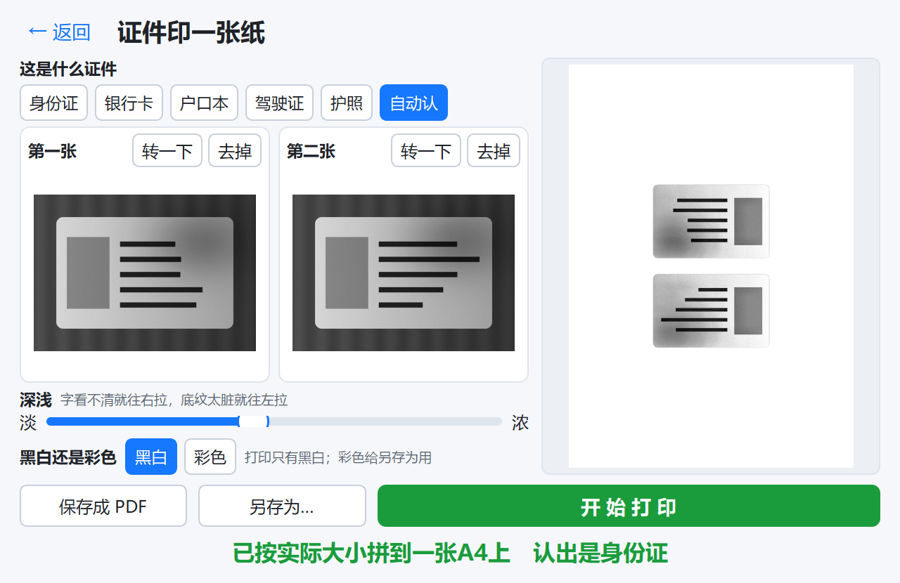
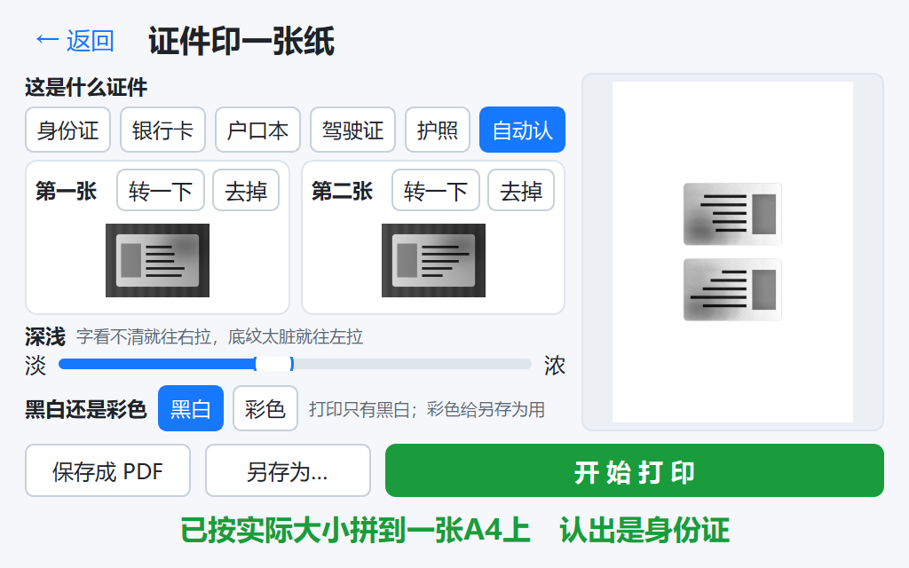

# 10 · 证件二合一

把身份证正反面、户口本两页这类小件拍照后拼到一张 A4 上。复印店最常见的活之一。



## 和普通打印不一样的地方：尺寸必须是实物大小

派出所、银行、学校要的是 **1:1 的复印件**。缩了放了都可能被退回来重做 —— 顾客要跑第二趟，这比"打得难看"严重得多。所以这一块所有设计都围着一件事：**保证打出来是实物尺寸，做不到就明说**。

难点在于"照片里只有像素，没有毫米"。恢复真实尺寸只有三条路：

| 依据 | 可靠性 | 什么时候用 |
|---|---|---|
| 用户选的证件类型 → 查预设表 | 最可靠 | 界面默认走这条，默认选中「身份证」 |
| 扫描件的 DPI 元信息 | 可靠 | 扫描仪出的图才有；手机拍的没有（或是 72 这种没意义的值） |
| 自动认：抠出卡片量**长宽比**去匹配预设 | 有歧义 | 用户选「自动认」时；拿不准就拒绝猜 |

## 尺寸预设表

| 类型 | 尺寸 (mm) | 圆角 (mm) | 出处 | 两个位置叫什么 |
|---|---|---|---|---|
| 身份证 | 85.6 × 54 | 3.18 | 国际标准 ISO/IEC 7810 ID-1 | 人像面 / 国徽面 |
| 银行卡 / 社保卡 | 85.6 × 54 | 3.18 | 国际标准（同上，都是 ID-1 卡） | 正面 / 反面 |
| 护照 | 125 × 88 | 0（书页是方角） | 国际标准 ISO/IEC 7810 ID-3 | 资料页 / 签注页 |
| 户口本 | 105 × 148 | 0（纸页是方角） | 常见值（按 A6） | 户主页 / 本人页 |
| 驾驶证 / 行驶证 | 88 × 60 | 3.0 | 常见值 | 主页 / 副页 |

圆角只用在"卡片外面涂白"那一步（见 [3](#3-往外放-15-再裁然后量一次卡片的边在哪)）：卡式证件四角是圆的，按方框涂白会在角上留四块桌面色。

### 验收标准：**纸上量出来和这张表一致**

这是能自动验证、也是真正要守住的那条线，`tests/test_physical_size.py` 盯着，分两层：

**一层看声明值**：每个预设的横放、竖放各跑一遍，打开生成的 PDF 直接量图片框的毫米。

```
类型              预设            纸张        排法    量出来          缩放
身份证             85.6×54.0      210×297     上下    85.60×54.00    1.000
身份证（竖着拍）      54.0×85.6      210×297     上下    54.00×85.60    1.000
户口本             148.0×105.0    210×297     上下    148.00×105.00  1.000
户口本（竖着拍）      105.0×148.0    297×210     左右    105.00×148.00  1.000
驾驶证 / 行驶证      88.0×60.0      210×297     上下    88.00×60.00    1.000
护照              125.0×88.0     210×297     上下    125.00×88.00   1.000
```

**一层看纸上真正有墨的范围**：从合成照片走完整条链路 → 渲染成 300dpi 位图 → 量墨迹的外接框。因为图片里比卡片多一圈白边（见 [3.5](#35-白边必须算进尺寸里不然小印-35)），只量声明值会漏掉"白边挤掉卡片"这种错 —— 真实照片上实测过，卡片本体只印出 82.6mm。

顺带把打印链路上别的产物也一起盯住 —— 都必须是 A4，不然同一家店出来的东西尺寸不一致：

| 产物 | 声明的页面尺寸 |
|---|---|
| 图片 → PDF | 210.0 × 297.0 |
| txt → PDF | 210.0 × 297.0 |
| OCR → Word | 210.0 × 297.0 |
| 证件二合一 → PDF | 210×297（或横放 297×210） |

**OCR 出的 Word 原来是 Letter（215.9×279.4mm）**——python-docx 自带模板就是美国纸张，我们一直没显式设过页面大小。店里只有 A4/A3，拿 Letter 的文档去打，Word 会自己缩放或者把版面挪位。已经在 `ocr.to_docx()` 里显式设成 A4，并加了断言盯着。

### 实物万一对不上

`verified` 字段记的是尺寸的**出处**（标准值 / 常见值），不影响出图 —— 两者都照样按实物尺寸写进 PDF。真拿尺子量出来不对，改 `core/cards.py` 的 `PRESETS` 里那一个数即可，`tests/test_physical_size.py` 会跟着一起验。自动识别时界面会附上按多少毫米算的，比如「认出是户口本（按 105×148 毫米算）」。

## 自动认类型：拿不准就不猜

护照（125×88，长宽比 **1.42**）和户口本（105×148，长宽比 **1.41**）的长宽比几乎一样，但尺寸差 16%。认错了顾客要跑第二趟。

所以 `identify_spec()` 的规则是：

1. 长宽比和某个预设差在 6% 以内才算候选
2. 候选里最优的那个，**必须比"尺寸不同的次优解"近一倍以上**，否则返回"分不清，请自己选类型"
3. 有扫描 DPI 时再用物理尺寸交叉验证，对不上就在界面上说出来

用户手选了类型但图片比例明显不符（超出同样的 6%）时，尺寸仍按他选的出（他说是身份证就按身份证打），但会提示「这张图的比例和身份证差得多，是不是选错类型了？」——拉伸出来的样子在预览里一眼就能看出不对。

## 流程

```
照片（选图片 / 粘贴 / 拖进来）
  ↓ ── analyze_card()：贵的一半，一张图只跑一次 ──────────────────
  ↓ detect_card()     找卡片：饱和度+亮度掩膜 → 凸包 → minAreaRect，再往外放 1.5%（见下）
  ↓ crop_card()       透视校正拉正，并**量出卡片本体在裁出图里的位置**
  ↓ identify_spec()   定证件类型（用户选的 / 自动认）
  ↓ _upright()        定朝向：横竖按预设算，上下用 OCR 分数二选一
  ↓ ── render_card()：便宜的一半，拖深浅滑块就重跑这段 ────────────
  ↓ _enhance_card()   温和增强：CLAHE + 轻拉伸 + 高光提亮 + 轻锐化（**不走去底链路**）
  ↓ _paint_outside()  卡片矩形外面涂白，四角按证件的圆角切
  ↓ 摆正 + 定尺寸      算的是"整张图该印多大"，让**卡片本体**正好落在实物尺寸上
  ↓ plan_layout()     挑一个能 1:1 放下的排法
  ↓ render_pdf()      毫米 × (72/25.4) → 点，直接写进 PDF 页面
一张 A4 的 PDF → 打印页（actual_size=True）
```

**为什么切成两半**：抠图 + OCR 判上下要 1–2 秒，增强 + 涂白只要几十毫秒。界面上拖「淡 ←→ 浓」滑块时只重跑后一半，实测 3.6 秒 → **0.3 秒**。顺带治了个隐患：每次都重新 OCR 判上下，深浅不同可能给出不一样的结论，滑块一动证件自己翻个面 —— 朝向存进 `CardPlan`，从此是稳的。

## 怎么把卡片从照片里抠出来（拿真实身份证照片调过）

第一版用的是整页文档那套 `approxPolyDP` 找四边形 + 四角接近直角，拿真实照片一试四条都不行，逐条记下修法：

### 1. 判据从"亮"改成"又亮又不鲜艳"

只按亮度做 Otsu 会把过曝的桌面一起圈进来。实测两张真实照片：

| | 卡片中心 | 木桌 |
|---|---|---|
| 饱和度 S | 32 | 67–69 |
| 亮度 V | 183–207 | 122–125 |

证件是浅色低饱和的，木桌是暖色高饱和的 —— 两个通道**取交集**（亮 ∩ 淡）才靠得住。只看亮度时长宽比被带偏到 1.49 / 1.55（真值 1.585），交集之后是 **1.593 / 1.585**。

灰度输入（扫描件、黑白照）没有饱和度可用，退回只看亮度。

### 2. 用 minAreaRect + 凸包，不用 approxPolyDP

**证件是圆角的**，多边形近似会把四个角切掉，框比卡片小一圈 —— 用户反馈的"裁剪过强"就是这个。外接矩形天然包住圆角。

再用**凸包**兜一层：卡片上有一道斜光时，阈值会从边上啃掉一块，轮廓本身的填充率掉到 0.82；凸包能把这块凹陷补回来。实测：

| 情况 | 轮廓填充率 | 凸包填充率 |
|---|---|---|
| 真实照片（掩膜正确） | 0.966–0.974 | **0.976–0.981** |
| 合成图（斜光啃掉一块） | 0.820–0.825 | **0.938–0.996** |
| 误检（卡片和桌面连成一片） | 0.766–0.829 | 0.876–0.895 |

所以判据是**凸包填充率 ≥ 0.92**：好的都在 0.938 以上，误检都在 0.895 以下，分得开。

### 3. 往外放 1.5% 再裁，然后**量一次**卡片的边在哪

顾客要的是"一张卡"的复印件，得看得见卡片的边和圆角。所以框往外放 1.5% 再裁，多出来的那一圈是桌面，后面涂白刷掉。

第一版拿"阈值掩膜收缩 1.2%"去涂白，真实照片上留下一圈毛边和黑点（掩膜边界是波浪形的：反光、木纹都会让它抖）。现在改成**量出来再按矩形涂**：

- 裁出来的图已经拉正，卡片就是一个正矩形 → 四条边各取 24 条扫描线，找"桌面→卡片"的亮度跳变（阈值取桌面和卡片中位数的中点），**取中位数**（挡得住个别反光行）
- 按量到的矩形涂白，边是直的；四角按证件自己的圆角半径画（身份证是 ISO 7810 的 **3.18mm**，写在 `PRESETS` 的 `corner_mm` 里）
- 再用**已知的长宽比**把矩形收准（`_fit_inset_to_ratio`，只收不放，最多收 3%）—— 四条边里总有一条会偏几个像素

为什么非量不可：检出的框和卡片总差零点几个百分点。同两张真实照片，四条边量出来是

| | 左 | 上 | 右 | 下 |
|---|---|---|---|---|
| 正面 | 1.79% | 2.70% | 1.91% | 1.43% |
| 反面 | 1.81% | 3.21% | 1.58% | 1.43% |

理论值都该是 1.46%（放了 1.5% 之后占裁出图的比例）。**上边差了一倍**，按理论值涂白就会在上边留一条一毫米宽的桌面暗边。

### 3.5 白边必须算进尺寸里（不然小印 3.5%）

这一条差点漏掉，是整条链路上最要紧的数：**声明的尺寸是"整张图该印多大"，不是"卡片该印多大"**。图里比卡片多了刚才那一圈白边，直接把整张图声明成 85.6×54，卡片本体就只印出 **82.6×52.1mm**（真实照片实测，短了 3mm）—— 而 1:1 正是这个功能存在的理由。

所以 `CardItem` 记两个数：`width_mm/height_mm` 是整张图的尺寸，`body_fraction` 是卡片本体占图的比例，`card_size_mm = 图尺寸 × 本体比例` 才是顾客拿尺子量的那个。定尺寸时反过来算：`图尺寸 = 实物尺寸 / 本体比例`。

验收不看声明值，看**纸上有墨的范围**（`tests/test_physical_size.py::test_照片进去_纸上量出来就是85_6乘54`）：把 PDF 渲染成 300dpi 位图，量墨迹的外接框。真实照片实测 **86.0×54.4mm**（目标 85.6×54.0，误差 +0.4mm，来自涂白边界那两三个像素的过渡）。

### 4. 摆正：横竖是确定的，上下用 OCR 定

用户反馈的"没有旋转到横向"：拍的时候卡是竖放的，出来还是竖的。**横竖不用猜** —— 身份证是横的（85.6×54），照片里竖着就说明该转 90°。

转完还剩一个二选一：可能上下颠倒。这个形状看不出来，就拿 OCR 比一下两种朝向哪种"更像字"（`sum(置信度 × 字数)`），明显更高才翻。识别不出来（没模型、报错）就保持原样 —— 宁可不转也不能转反。

界面上还留了个「转一下」按钮：自动判错时长辈点一下就好，比让顾客重新拍一张强。

## 增强：证件不能走去底那条链路

用户反馈"处理得有点过曝"。原因是证件走了「图文混排」的去底链路：`flatten_illumination` 是除法，证件本来光照就均匀，除完只是把高光推到纯白 —— 实测有 **26–29%** 的像素顶到 250 以上，人像糊成一片白。

改成"温和还原"（`_enhance_card`）：CLAHE 提局部对比（保住人像层次）+ 轻微百分位拉伸（0.3%/99.7%）+ **高光提亮** + 一点锐化。人像不再被冲白（合成卡片上那块 150 的灰，全程稳定在 132–142）。

### 深浅滑块：一个定值伺候不了所有照片

第二轮反馈：**"处理得图片有点过度，有时候字可能看不清"**。身份证是满版防伪网纹，局部对比一提，网纹和字一样黑，字就埋进网纹里了。而拍照条件差别极大（逆光、暖光台灯、旧证件磨花），固定参数必然有一头不合适 —— 所以界面上给了「淡 ←→ 浓」滑块，三个参数一起跟着走：

| | 淡（0） | 默认（30） | 浓（100） |
|---|---|---|---|
| CLAHE `clipLimit` | 1.1 | 1.7 | 3.0 |
| 高光提亮的白点 | 205 | 220 | 255（等于不提） |
| 锐化 `amount` | 0.22 | 0.30 | 0.50 |

真实身份证照片实测（底纹取无字处一块）：

| 深浅 | 底纹均值 | 纯白像素 | 字（p2） |
|---|---|---|---|
| 0 | 217 | 52% | 14 |
| 30（默认） | 205 | 40% | 12 |
| 100 | 166 | 4% | 8 |

**高光提亮用亮度阈值，不用百分位**：底纹占多少像素随证件、随拍照角度差很多，按百分位裁会时轻时重；按亮度裁，"多亮算背景"就是多亮算背景。膝点（白点 − 40）以下一个字节都不动，所以黑字和人像暗部不受影响 —— 这也是为什么它能同时"底纹更淡"和"字更清楚"。

默认值定在 **30**（偏淡那一侧）：底纹淡、字利，人像还有层次。配置项是 `cards.strength`，长辈拖过滑块就存下来（`CardsConfig().strength` 必须和 `cards.DEFAULT_STRENGTH` 一致，`tests/test_cards.py` 盯着）。

## 界面：两个图片框 + 一个滑块

第一版是"名字 + 状态文字 + 三个按钮"两横排（页首那张图是改完之后的），用户反馈两条，都改了：

- **"看不见自己放进去的是哪张图"** → 现在是两个图片框，放好之后框里直接显示**原图缩略图**（不是处理后的）。长辈第一件要确认的事是"这张是不是拿对了面"；处理成什么样，右边那张 A4 预览会画出来。点框任意位置 = 选图片，也能直接把图片拖进框、或者点「粘贴」贴剪贴板里的图
- **"按钮占的位置太多了"**（反馈了两轮）→ 逐项砍，量出来的账见下

### 按钮和预览的空间账（1024×640，最坏的店铺屏）

| | 按钮占窗口面积 | A4 纸画出来 |
|---|---|---|
| 反馈前 | 22.4% | 210×297px（9.5%） |
| 第一轮改完 | 17.0% | 210×290px（9.4%） |
| 现在 | **17.1%** | **272×386px（16.0%）** |

第一轮只把按钮改小了，预览没跟着变大 —— 因为高度是被"控件区在上、预览在右"这个结构锁住的。第二轮的做法：

- **右边一整列从上到下全是预览**，类型行、深浅行都挪进左边那一列 —— 控件区省下的高度这才真的归了预览
- 类型的小标题单独占一行、按钮保持自己的宽度靠左（不再填满整行）。小标题不和按钮挤一行是有原因的：挤一行会把左列的最小宽度撑到 740px，1024 的小屏上预览就只剩最小宽度了
- 图片框里的「转一下 / 去掉」搬到**名字那一行**，省下的 52px 全给缩略图
- 状态提示一行写完（20pt 大字，多一行就吃掉 33px）
- 剩下 17.1% 里，7.4% 是那个必须巨大的「开始打印」（规范硬要求 ≥56px），1% 是「← 返回」

「转一下」是人工兜底（自动摆正判错时点一下转 90°），它**不重新抠图**：只把算好的结果转一下，所以是瞬时的。

### 底下那一行：保存 / 另存为 / 打印

三个按钮**一样高**（渲染出来都是 60px）。中间踩过一个坑：白按钮写 `min-height: 56px` 渲染出来是 60px（QSS 的 min-height 管内容区，2px 边框上下再加 4px），而无边框的绿主按钮写 56 就真是 56 —— 差这 4px 看着就像没做完，所以主按钮那条规则写的是 60。

两种保存都留着，对应柜台上两种情形：

- **保存成 PDF**：一键存到设置里配的那个文件夹（默认 `%LOCALAPPDATA%\ShopPrint\output`，长辈找不到那个路径，所以设置里能改成桌面或者 D 盘）。连着干活时最省事
- **另存为…**：顾客要求存到指定位置（U 盘、某个客户文件夹）时用。对话框默认开在"上次存过的地方"，没有就开在上面那个默认文件夹；扩展名忘了写会自动补 `.pdf`

配置项是 `output.dir` 和 `output.last_save_dir`，「照片变清楚」的保存、OCR 的另存为也都走同一套（见 `config.save_dir / config.dialog_dir`）。

### 黑白 / 彩色

默认黑白（店里那台柯美只有黑白），开彩色是为了**存出来的 PDF** —— 身份证的红色国徽、证件上的蓝色印章、驾驶证的彩色底纹都能留住。打印那条路不受影响：GDI 打印走 `render_page_gray`，驱动那边自己转灰。

实现上不另写一套：亮度还是 `_enhance_card()` 那条链路（CLAHE + 拉伸 + 高光提亮 + 锐化），算完用 `enhance.recolor_by_luma()` 把颜色按"新亮度 / 旧亮度"的比例带回来；涂白那一步顺手改成三通道也吃。**尺寸和朝向完全不受颜色影响**（`tests/test_cards.py` 盯着这条 —— 颜色只该改颜色）。

切换颜色和拖深浅滑块一样，只重跑 `render_card()`，不重新抠图（实测 1.1 秒出结果）。

1024×640 下的样子，`scripts/make_screenshots.py` 会一起生成：



## 排版：自己挑纸张方向

候选顺序是「纵向纸上下排 → 纵向纸左右排 → 横向纸上下排 → 横向纸左右排」，取第一个能按实物尺寸放下的；都放不下才缩，并把缩放比例报给界面。

两个真实例子：

- **身份证正反面**：85.6×54 两张上下排 = 85.6 × 118mm，纵向 A4 轻松放下 → 纵向纸，上下排（这也是复印店的习惯排法）
- **户口本两页**：105×148 两页并排要 220mm，超过 A4 的 210mm；**换成横向 A4 就放得下**（220 × 148 落在 297×210 里），而且两页都还是正着看的 → 自动切横向纸

四张身份证（两个人）也能一张纸：上下排四张 = 85.6 × 246mm，纵向 A4 放得下。

排版留了 6mm 安全边（打印机四周吃边）和 10mm 间隔（留一点好剪）。

## 打印时也不能缩：`actual_size`

**这一步最容易被忽略。**PDF 里的尺寸对了，打印时还可能被缩：默认的 GDI 打印路径是「整页等比缩放到可打印区域」，而真打印机四周有 4–5mm 打不到的边 —— 缩放比例约 0.96，85.6mm 的身份证就打成了 82mm。

所以 `PrintSettings.actual_size=True` 走另一条路（`printing._draw_actual_size`）：

```
页面宽像素 = 页面宽(pt) / 72 × 打印机 DPI
画的位置   = (-PHYSICALOFFSETX, -PHYSICALOFFSETY)
```

DC 的原点在**可打印区**左上角，而它距离纸张左上角有 `PHYSICALOFFSET` 那么远；把这段补回去，页面的 1mm 才正好落在纸的 1mm 上。超出可打印区的部分由驱动裁掉 —— 排版留的 6mm 安全边正是为此。

普通文档**不开**这个（默认 False）：那种情况宁可整体缩一点，也不要把边上的内容裁掉。

**开发机上验不了真机行为**：「Microsoft Print to PDF」的可打印区正好等于纸张（`PHYSICALOFFSET=0`），所以缩放比例是 1.0，两条路径结果一样。柯美 225i 的实际边距只能到店铺机上验：打一张证件出来，看长边是不是 85.6mm。**PDF 里声明的尺寸已经有断言守着**（见上），这里剩下的风险只有"驱动是不是照着 PDF 的尺寸走"。

## 隐私

证件照片和拼好的 PDF 落在 `%LOCALAPPDATA%\ShopPrint\cache\`（文件名形如 `证件-20260817-003447.pdf`）。这些是顾客的身份证件，**定期清空缓存目录**；`samples/` 和仓库里绝不放真实证件照（插图用的是合成卡片）。

第二阶段做小程序时，证件类文件不进云端存储 —— 见 [08-第二阶段-微信小程序](08-第二阶段-微信小程序.md) 的安全边界。
